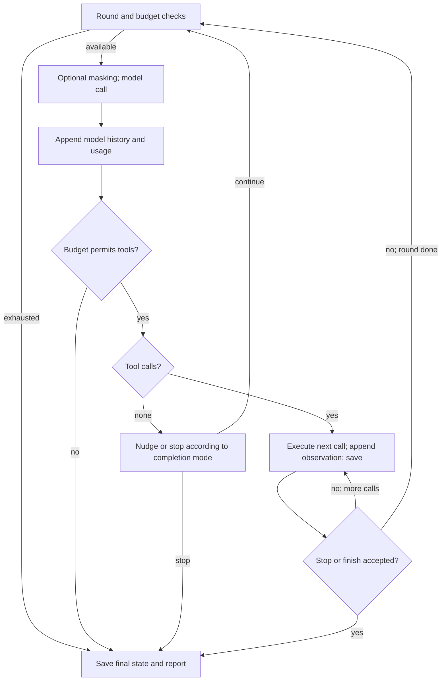

# OneHand architecture

[Back to README](../README.md)

Line anchors match release v0.4.0. Links name a function or identifier as well as its line,
so they stay findable if lines move.

## Overview

OneHand runs a task through a provider-neutral model/tool loop. The runner owns history,
usage, stopping, and persistence; a tool registry validates and dispatches calls; a plan
controller decides whether mutation and completion are permitted. Providers translate
model responses into common tool calls, while executors run commands locally or inside
an evaluation container. The CLI, chat interface, and evaluation drivers call this runtime.
See [`src/agent/runner.ts` `runAgent`](../src/agent/runner.ts#L130), [`src/tools/registry.ts` `createToolRegistry`](../src/tools/registry.ts#L50), and [`src/providers/types.ts` `ModelProvider`](../src/providers/types.ts#L30).

### Module map

| Directory/file | Responsibility and entry point |
| --- | --- |
| `src/cli.ts` | Commander commands and argument handling: [`program`](../src/cli.ts#L15). |
| `src/index.ts` | Library exports, including [`runAgent`](../src/index.ts#L1). |
| `src/types.ts` | Shared run, plan, command, and result shapes: [`RunReport`](../src/types.ts#L79). |
| `src/agent/runner.ts` | Model rounds, tool observations, budgets, and final report: [`runAgent`](../src/agent/runner.ts#L130). |
| `src/agent/planning.ts` | Plan transitions and completion checks: [`PlanController`](../src/agent/planning.ts#L13). |
| `src/agent/prompt.ts`, `profile.ts`, `localProfile.ts` | Prompt templates and feature selection: [`effectiveSystemPrompt`](../src/agent/prompt.ts#L19), [`PROFILES`](../src/agent/profile.ts#L23), [`resolveLocalProfile`](../src/agent/localProfile.ts#L3). |
| `src/agent/persistence.ts`, `fingerprint.ts` | Saved runs and behavior identity: [`RunStore`](../src/agent/persistence.ts#L48), [`agentBehaviorFingerprint`](../src/agent/fingerprint.ts#L25). |
| `src/agent/events.ts`, `projectMemory.ts`, `subagents.ts` | Observer events, project instructions, and child runs: [`AgentEvent`](../src/agent/events.ts#L5), [`loadProjectInstructions`](../src/agent/projectMemory.ts#L8), [`runSubagent`](../src/agent/subagents.ts#L50). |
| `src/providers/` | Provider adapters and history masking: [`createModelProvider`](../src/providers/index.ts#L7), [`maskProviderHistory`](../src/providers/historyMasking.ts#L18). |
| `src/tools/registry.ts`, `schema.ts`, `render.ts` | Tool definitions, dispatch, validation, observations: [`createToolRegistry`](../src/tools/registry.ts#L50), [`parseAndValidateArgs`](../src/tools/schema.ts#L17), [`renderToolResult`](../src/tools/render.ts#L6). |
| `src/tools/fileTools.ts`, `git.ts`, `testCommand.ts` | Repository inspection/editing, Git evidence, test detection: [`readRepoFile`](../src/tools/fileTools.ts#L158), [`gitDiff`](../src/tools/git.ts#L62), [`detectTestCommand`](../src/tools/testCommand.ts#L33). |
| `src/tools/pathGuard.ts`, `command.ts` | Path confinement and command policy: [`resolveSafeRepoPath`](../src/tools/pathGuard.ts#L38), [`commandPolicyError`](../src/tools/command.ts#L166). |
| `src/runtime/` | Command execution, bounded capture, shadow Git: [`LocalExecutor`](../src/runtime/executor.ts#L43), [`OutputCapture`](../src/runtime/outputCapture.ts#L9), [`CheckpointStore`](../src/runtime/checkpoints.ts#L25). |
| `src/policy/permissions.ts`, `src/mcp/` | Approval decisions and MCP connections: [`PermissionEngine`](../src/policy/permissions.ts#L58), [`McpManager`](../src/mcp/manager.ts#L31). |
| `src/repl/` | Chat session, input, and event rendering: [`runRepl`](../src/repl/index.ts#L71), [`ReplInput`](../src/repl/input.ts#L7), [`ReplRenderer`](../src/repl/renderer.ts#L18). |
| `src/web/` | Read-only HTTP UI, artifact readers, and browser assets: [`startWebUi`](../src/web/server.ts#L18), [`ConfinedDirectory`](../src/web/files.ts#L40), [`WEB_HTML`](../src/web/assets.ts#L1). |
| `src/pricing.ts`, `src/utils/truncate.ts` | Usage-cost arithmetic and byte-aware truncation: [`estimateCost`](../src/pricing.ts#L56), [`truncateText`](../src/utils/truncate.ts#L3). |
| `eval/run.ts`, `core.ts` | Synthetic evaluation orchestration and shared concurrent scheduling: [`runEvaluation`](../eval/run.ts#L64), [`runJobs`](../eval/core.ts#L77). |
| `eval/tasks.ts`, `fixture.ts`, `types.ts` | Task definitions, fixture preparation, and evaluation contracts: [`TASKS`](../eval/tasks.ts#L42), [`prepareFixture`](../eval/fixture.ts#L22). |
| `eval/cli.ts`, `env.ts`, `results-io.ts`, `report.ts` | Evaluation CLI configuration, result loading, and reports: [`loadDeepSeekEnvironment`](../eval/env.ts#L12), [`loadResultSet`](../eval/results-io.ts#L20), [`writeEvaluationReport`](../eval/report.ts#L8). |
| `eval/swebench/evaluate.ts`, `runInstance.ts` | Multi-variant scheduling and per-instance lifecycle: [`scheduleRuns`](../eval/swebench/evaluate.ts#L259), [`runInstance`](../eval/swebench/runInstance.ts#L169). |
| `eval/swebench/dataset.ts`, `workspace.ts`, `container.ts` | Dataset boundary, copied checkout, container lifecycle: [`agentTaskFor`](../eval/swebench/dataset.ts#L203), [`prepareWorkspace`](../eval/swebench/workspace.ts#L22), [`startContainer`](../eval/swebench/container.ts#L78). |
| `eval/swebench/prepare_dataset.py`, `splits.json`, `exclusions.json` | Dataset preparation, frozen split IDs, and explicit exclusions: [`main`](../eval/swebench/prepare_dataset.py#L41), [`SPLITS_PATH`](../eval/swebench/dataset.ts#L66), [`EXCLUSIONS_PATH`](../eval/swebench/dataset.ts#L67). |
| `eval/swebench/patch.ts`, `grade.ts` | Patch extraction and official-harness grading: [`extractPatch`](../eval/swebench/patch.ts#L34), [`gradeRun`](../eval/swebench/grade.ts#L86). |
| `eval/swebench/cli.ts`, `selfcheck.ts`, `summary.ts` | SWE-bench commands, pipeline checks, and summaries: [`runSelfcheck`](../eval/swebench/selfcheck.ts#L91), [`writeSwebenchReport`](../eval/swebench/summary.ts#L13). |
| `eval/swebench/external.ts`, `external-report.ts` | External prediction import/grading and separate reports: [`gradeExternal`](../eval/swebench/external.ts#L112), [`writeExternalReport`](../eval/swebench/external-report.ts#L38). |
| `eval/compare.ts`, `stats.ts`, `analyze.ts` | Paired comparisons, bootstrap/Holm calculations, and trace diagnosis: [`bootstrapReplicates`](../eval/stats.ts#L44), [`diagnoseRun`](../eval/analyze.ts#L68). |

## One task, end to end

1. **Parse `onehand run <task> --repo <path>`.** Commander collects provider, profile,
   verification command, limits, persistence paths, and output options. The `run` action
   requires the selected provider credential, explicitly enables planning and persistence,
   and calls the runner. [`src/cli.ts` `program`](../src/cli.ts#L22)
2. **Resolve the profile.** The CLI defaults to `ctx`; local resolution rejects profiles
   requiring sandbox commands. Direct library calls default to `baseline` when no profile
   is supplied. [`src/agent/localProfile.ts` `resolveLocalProfile`](../src/agent/localProfile.ts#L3),
   [`src/agent/runner.ts` `runAgent`](../src/agent/runner.ts#L130)
3. **Construct the provider and runtime.** The runner normalizes the repository, selects
   the executor, creates the provider, establishes limits, and loads or creates run storage.
   The provider factory chooses DeepSeek Chat or OpenAI Responses.
   [`src/agent/runner.ts` `runAgent`](../src/agent/runner.ts#L130), [`src/providers/index.ts` `createModelProvider`](../src/providers/index.ts#L7)
4. **Assemble instructions and history.** The profile selects the system prompt; the user
   prompt contains task, model-visible repository root, test command, and optional targets.
   A fresh run uses `provider.initialHistory`; resume uses saved history. Project instructions
   are appended only when the caller supplies them. [`src/agent/prompt.ts` `effectiveSystemPrompt`](../src/agent/prompt.ts#L19),
   [`src/agent/prompt.ts` `buildUserPrompt`](../src/agent/prompt.ts#L37), [`src/agent/runner.ts` `runAgent`](../src/agent/runner.ts#L130)
5. **Start a round.** Check aggregate budgets, optionally mask old observations, then call
   the provider with history, instructions, tool schemas, and remaining output allowance.
   Retry handling wraps the provider call. [`src/agent/runner.ts` `budgetReason`](../src/agent/runner.ts#L829),
   [`src/agent/runner.ts` `completeWithRetry`](../src/agent/runner.ts#L774)
6. **Normalize the response.** Adapters return replayable history items, text, usage, and
   `{id, name, arguments}` calls. The runner appends model history before executing calls,
   charges usage, checks budgets again, and processes calls sequentially.
   [`src/providers/deepseek.ts` `complete`](../src/providers/deepseek.ts#L28),
   [`src/providers/openaiResponses.ts` `complete`](../src/providers/openaiResponses.ts#L59), [`src/agent/runner.ts` `runAgent`](../src/agent/runner.ts#L130)
7. **Dispatch and validate.** Registry execution finds the exposed definition, parses JSON
   arguments, and checks the schema. Unknown tools or invalid arguments return a recoverable
   result. Plan tools go directly to the plan controller; action tools encounter the planning
   gate and applicable authorization hook. [`src/tools/registry.ts` `execute`](../src/tools/registry.ts#L103),
   [`src/tools/schema.ts` `parseAndValidateArgs`](../src/tools/schema.ts#L17)
8. **Constrain and execute an action.** File tools resolve safe paths; commands validate cwd,
   arguments, and policy before executor dispatch. Writes and test verification update the
   plan's revision counters. [`src/tools/pathGuard.ts` `resolveSafeRepoPath`](../src/tools/pathGuard.ts#L38),
   [`src/tools/registry.ts` `validateCommandPaths`](../src/tools/registry.ts#L562),
   [`src/tools/command.ts` `commandPolicyError`](../src/tools/command.ts#L166), [`src/runtime/executor.ts` `LocalExecutor`](../src/runtime/executor.ts#L43)
9. **Return an observation.** `compactObservations` selects bounded plain-text rendering;
   otherwise the registry result becomes indented JSON. The provider wraps the observation
   with the matching call ID, and the runner appends it to history, records failures, traces
   the outcome, and saves state. [`src/tools/render.ts` `renderToolResult`](../src/tools/render.ts#L6),
   [`src/tools/registry.ts` `serializeToolResult`](../src/tools/registry.ts#L335), [`src/agent/runner.ts` `runAgent`](../src/agent/runner.ts#L130)
10. **Continue or stop.** Accepted `finish_task`, blocked plans, budgets, cancellation,
    model errors, and runtime failures stop the loop. With planning enabled, text-only turns
    receive at most two default nudges before failure. A separate `completion: "answer"`
    mode permits child/chat question answers. [`src/agent/runner.ts` `runAgent`](../src/agent/runner.ts#L130),
    [`src/agent/planning.ts` `finish`](../src/agent/planning.ts#L111)
11. **Persist and report.** The runner collects Git status/diff and executed command/test
    records, saves final state, emits `run_finished`, and returns `RunReport`. The CLI prints
    JSON or a human report, optionally writes `--report`, and exits nonzero unless successful.
    [`src/agent/runner.ts` `saveCheckpoint`](../src/agent/runner.ts#L1043),
    [`src/cli.ts` `printHumanReport`](../src/cli.ts#L215), [`src/cli.ts` `program`](../src/cli.ts#L22)

### Round loop

This diagram follows [`src/agent/runner.ts` `runAgent`](../src/agent/runner.ts#L130);
the registry owns the checks inside “Execute next call.”



### One command tool call

The successful path below is `run_command` with planning enforced and no interactive
authorization hook. Rejection paths return an error observation before process launch.
Sources: [`src/tools/registry.ts` `execute`](../src/tools/registry.ts#L103), [`src/runtime/executor.ts` `LocalExecutor`](../src/runtime/executor.ts#L43).

```mermaid
sequenceDiagram
    participant R as Runner
    participant T as ToolRegistry
    participant S as Schema validator
    participant P as PlanController
    participant E as Executor
    R->>T: execute(name, arguments)
    T->>S: parseAndValidateArgs
    S-->>T: validated arguments
    T->>P: canMutate (unless lean inspection)
    P-->>T: allowed
    T->>T: resolve paths; validate command policy
    T->>E: run(program, args, cwd, timeout)
    E-->>T: bounded command result
    T->>P: recordWrite if accounting requires it
    T-->>R: ToolResult
    R->>R: render; append provider tool result; trace/save
```

## Key data structures

| Structure | Fields and interpretation | Source |
| --- | --- | --- |
| `ProviderRequest` / `ProviderTurn` | Requests carry instructions, opaque provider history, tools, inference settings, and signal; turns return history items, calls, text, usage, and finish reason. | [`src/providers/types.ts` `ProviderRequest`](../src/providers/types.ts#L18), [`src/providers/types.ts` `ProviderTurn`](../src/providers/types.ts#L9) |
| `NormalizedToolCall` | `id`, `name`, `arguments` as JSON text or an object. | [`src/providers/types.ts` `NormalizedToolCall`](../src/providers/types.ts#L3) |
| `ToolResult<T>` | Success carries `data` and optional `truncated`; failure carries `error`, `recoverable`, and optional environment classification. | [`src/types.ts` `ToolResult`](../src/types.ts#L6) |
| `PlanSnapshot` | Revision, status, steps, `needsReplan`, `writeRevision`, `validatedWriteRevision`, optional summary. Each step has ID, description, status, and optional evidence. | [`src/types.ts` `PlanSnapshot`](../src/types.ts#L58), [`src/types.ts` `PlanStep`](../src/types.ts#L51) |
| `RunUsage` | Model rounds, tool calls, wall time, optional child rounds, and input/output/cache/total/reasoning token counters. | [`src/types.ts` `RunUsage`](../src/types.ts#L42), [`src/types.ts` `TokenUsage`](../src/types.ts#L33) |
| `PersistedRunState` | Version/run identity; task/repo/HEAD/worktree fingerprint; provider/model/history; plan/usage/records; hashed failure counts; message/status/reason; nudge/masking state and timestamps. | [`src/agent/persistence.ts` `PersistedRunState`](../src/agent/persistence.ts#L11) |
| `RunReport` | Status, stop reason, changed files, commands, tests, diff, final message, usage, plan, and artifact paths. | [`src/types.ts` `RunReport`](../src/types.ts#L79) |

DeepSeek history contains assistant messages with `tool_calls` and, when supplied,
`reasoning_content`; subsequent calls replay that history. Tool observations use
`role: "tool"` and `tool_call_id`. Raw reasoning survives the live loop, but saved state
redacts it. Commit `6d3ead1` records that dropping it caused a second-round API rejection.
Sources: [`src/providers/deepseek.ts` `complete`](../src/providers/deepseek.ts#L28), [`src/providers/deepseek.ts` `toolResultItem`](../src/providers/deepseek.ts#L86), [`src/agent/persistence.ts` `redactDeep`](../src/agent/persistence.ts#L151).

OpenAI history instead holds Responses output items and `function_call_output` observations.
The adapter removes trailing reasoning items because, as its comment states, replaying a
reasoning item without its following output is rejected. [`src/providers/openaiResponses.ts` `toolResultItem`](../src/providers/openaiResponses.ts#L103), [`src/providers/openaiResponses.ts` `replayableOutput`](../src/providers/openaiResponses.ts#L113).

## Cross-cutting mechanisms

<a id="planning-gate"></a>

### Planning gate and repeated failure

`setPlan` creates 1–8 nonempty steps. `canMutate` refuses an unset/blocked plan or a pending
replan; the registry applies it to writes, replacements, commands, and tests. Under E1,
tests and E8 read-only inspection commands bypass that gate. [`src/agent/planning.ts` `setPlan`](../src/agent/planning.ts#L24), [`src/agent/planning.ts` `canMutate`](../src/agent/planning.ts#L92), [`src/tools/registry.ts` `execute`](../src/tools/registry.ts#L103).

Two failed observations with the same normalized name/arguments require replanning;
failed tests count even when the enclosing result is `ok: true`. Signatures are hashed
so persisted keys do not retain raw arguments, as the runner comment explains. Baseline
updates clear the flag; E1 batch updates require nonempty evidence, without checking its
meaning. [`src/agent/runner.ts` `stableSignature`](../src/agent/runner.ts#L893), [`src/agent/runner.ts` `isFailedObservation`](../src/agent/runner.ts#L888), [`src/agent/runner.ts` `runAgent`](../src/agent/runner.ts#L130), [`src/agent/planning.ts` `updatePlan`](../src/agent/planning.ts#L45), [`src/agent/planning.ts` `updatePlanBatch`](../src/agent/planning.ts#L68).

<a id="completion-invariant"></a>

### Completion invariant

`finish` requires a nonempty summary, an existing plan, no pending replan, all steps
completed, and `validatedWriteRevision === writeRevision`. Initial values are `-1` and
`0`, so even a no-write finish needs verification. Baseline step evidence is optional;
E1 `stepEvidence` can atomically complete remaining steps with nonempty evidence. [`src/agent/planning.ts` `finish`](../src/agent/planning.ts#L111), [`src/agent/planning.ts` `emptyPlan`](../src/agent/planning.ts#L150).

`run_tests` passes only with exit code zero, no timeout, and no output overflow.
Targets verify the latest change only when `allowTargetedVerification` is enabled;
otherwise an untargeted pass is needed. A passing verification records the current write
revision. Failed verification does not erase a prior validated revision; a later write makes
that revision stale. These checks do not establish semantic task correctness. [`src/tools/registry.ts` `execute`](../src/tools/registry.ts#L103), [`src/agent/planning.ts` `recordValidation`](../src/agent/planning.ts#L103).

<a id="write-accounting"></a>

### What counts as a write

Without E1, successful file edits and `ok` command executions increment `writeRevision`;
executed tests also increment it before recording validation. A nonzero command exit can
still be an `ok` execution. With E1, file edits compare per-file digests, and commands/tests
compare repository content before and after execution. [`src/tools/registry.ts` `execute`](../src/tools/registry.ts#L103), [`src/tools/registry.ts` `fileContentDigest`](../src/tools/registry.ts#L520).

The repository digest hashes changed paths from Git porcelain, file bytes, executable bits,
symlink targets, and missing-file markers; ignored files are outside that digest.
Unavailable/truncated evidence or changed protected paths makes digest acquisition fail.
The command still runs and conservatively counts as a write. Commit `d99265a` explicitly
rejects blocking commands on digest failure. [`src/tools/git.ts` `repositoryContentDigest`](../src/tools/git.ts#L100), [`src/tools/registry.ts` `createToolRegistry`](../src/tools/registry.ts#L50).

<a id="path-guard"></a>

### Path guard and protected secrets

Paths must remain inside the real repository root lexically and after resolving existing
symlinks/parents. Protected components include `.git`, `.onehand`, `.env`/`.env.*`, package credential
files, SSH private-key names, and `.pem`/`.key`/`.p12` suffixes. Command arguments and test
targets receive additional checks. These are tool-level checks; local commands still run
on the host. [`src/tools/pathGuard.ts` `resolveSafeRepoPath`](../src/tools/pathGuard.ts#L38), [`src/tools/pathGuard.ts` `isProtectedRepoPath`](../src/tools/pathGuard.ts#L80), [`src/tools/registry.ts` `validateTestTarget`](../src/tools/registry.ts#L545), [`src/runtime/executor.ts` `LocalExecutor`](../src/runtime/executor.ts#L43).

<a id="command-policy"></a>

### Local and sandbox command policy

Commands use a structured program/argument list and `shell: false`. String commands pass
through `parseCommand`, which rejects unquoted shell operators. Program policy rejects
shell interpreters, network tools, and disallowed dependency mutations;
local model calls must use repository tools for file/Git inspection and cannot use inline
code. E8 requires a Docker executor and admits Python `-c`, Node `-e`, and restricted
inspection commands, while still refusing installs, mutating Git, `sed -i`, and `find -exec`. [`src/tools/command.ts` `parseCommand`](../src/tools/command.ts#L42), [`src/tools/command.ts` `commandPolicyError`](../src/tools/command.ts#L166), [`src/tools/registry.ts` `validateCommandPaths`](../src/tools/registry.ts#L562), [`src/tools/registry.ts` `createToolRegistry`](../src/tools/registry.ts#L50).

An operator-trusted test command bypasses model command policy, but appended targets remain
validated. Permission approval does not bypass these command/path checks. E8's motivation
is recorded in commit `17843e4`: diagnostics were being rejected inside the network-less
evaluation container. [`src/tools/registry.ts` `execute`](../src/tools/registry.ts#L103).

<a id="budgets"></a>

### Budgets and stop conditions

Library defaults are 20 aggregate rounds, 40 tool calls, 300,000 cumulative input tokens,
40,000 output tokens, 8,192 output tokens per turn, and 900 seconds wall time.
The local `run` and `chat` commands default to 60 rounds, 120 tool calls, 2,000,000 input tokens,
100,000 output tokens and 1,800 seconds. Those values cover 112 of the 144 resolved `ctx-sandbox`
runs in the 2026-09-26 window; the library defaults cover 20.
The runner checks before/after model calls, counts failed tool calls, and caps each request's
output allowance by remaining output tokens. Aggregate tokens are usage-based checks,
not an advance guarantee about the next response. [`src/agent/runner.ts` `runAgent`](../src/agent/runner.ts#L130), [`src/agent/runner.ts` `budgetReason`](../src/agent/runner.ts#L829).

The default model-call policy permits three attempts with exponential delay under one
request deadline, retrying rate limits, server failures, and recognized connection errors.
Environment failures stop as `runtime_error`; accepted finish, blocked plan, cancellation,
text-only exhaustion, and step/tool/token/time exhaustion have separate stop reasons. [`src/agent/runner.ts` `completeWithRetry`](../src/agent/runner.ts#L774), [`src/agent/runner.ts` `isRetryableModelError`](../src/agent/runner.ts#L910), [`src/types.ts` `StopReason`](../src/types.ts#L19).

<a id="persistence-resume"></a>

### Persistence, resume, and worktree fingerprint

`RunStore` persists schema version 4 and defaults to `~/.onehand/runs/<runId>`. State uses atomic rename and trace uses
JSONL append; directory/file modes are requested as `0700`/`0600`. Redaction filters known
secret patterns and sensitive keys, exempting usage counters. After each tool, saved history
includes synthetic results for still-unexecuted calls; these placeholders do not execute
those calls on resume. [`src/agent/persistence.ts` `RunStore`](../src/agent/persistence.ts#L48), [`src/agent/persistence.ts` `redactDeep`](../src/agent/persistence.ts#L151), [`src/agent/runner.ts` `appendSkippedToolResults`](../src/agent/runner.ts#L978).

Resume rejects completed runs, task/repo/provider/model/HEAD mismatches, and unavailable or
different worktree fingerprints. Fingerprints cover changed tracked, untracked, and selected ignored
paths, metadata, symlink targets, and nonprotected file contents up to 1 MiB; they are not
full content hashes for every file. Each save refreshes the fingerprint. Schema 4 also stores
the profile, the agent behavior fingerprint and a run behavior fingerprint of the effective
prompts, tools, inference settings and verification policy; `validateResume` rejects any
mismatch before a model call, and legacy states without this identity require a new run.
Total budgets may grow on resume; the per-turn output cap is part of the identity. [`src/agent/runner.ts` `validateResume`](../src/agent/runner.ts#L940), [`src/agent/runner.ts` `readWorktreeFingerprint`](../src/agent/runner.ts#L991), [`src/agent/runner.ts` `saveCheckpoint`](../src/agent/runner.ts#L1043), [`src/cli.ts` `program`](../src/cli.ts#L22).

<a id="shadow-git"></a>

### Shadow-Git checkpoints and chat undo

`CheckpointStore` keeps a separate bare repository outside the worktree, keyed by the
real repository path. Snapshots exclude protected/ignored paths and files over 5 MiB.
When enabled, the runner snapshots before the first eligible mutation in a model round.
Chat `/undo` restores the first checkpoint of its latest run; `/rewind n` selects a listed
checkpoint. Restoration can remove files added since the target, subject to path/exclusion
checks. It restores files, not saved model history or usage. [`src/runtime/checkpoints.ts` `CheckpointStore`](../src/runtime/checkpoints.ts#L25), [`src/runtime/checkpoints.ts` `restore`](../src/runtime/checkpoints.ts#L62), [`src/agent/runner.ts` `runAgent`](../src/agent/runner.ts#L130), [`src/repl/index.ts` `runRepl`](../src/repl/index.ts#L71).

<a id="chat-sessions"></a>

### Chat sessions and the repository lock

Each chat task runs through a normal `RunStore`. `ChatSessionStore` adds an owner-only
`session.json` outside the repository with the effective configuration, recent conversation,
cumulative usage, the active task pointer and its first checkpoint. A task is written as
`prepared` before and `running` after a provider request may start, so a crash in between
fails closed instead of replaying the request; a run already saved as successful is merged
once without replay. `/discard` writes a receipt before clearing the pointer. Chat holds an
exclusive per-repository lock: a ref in a private bare Git store updated by compare-and-swap,
reclaimable only when its owner is confirmed dead on the same host. The lock error prints a
command that clears a stale lock. Checkpoint operations use a second lock scope. [`src/repl/session.ts` `ChatSessionStore`](../src/repl/session.ts#L62), [`src/runtime/repositoryLock.ts` `acquireRepositoryLock`](../src/runtime/repositoryLock.ts#L41).

<a id="permissions"></a>

### Permission modes and approvals

Chat defaults to `edit` and injects an authorization callback; `onehand run` does not expose
this interactive mode option. Risk classes are read, plan, write, exec, and MCP. Mode defaults
allow reads/planning; `ask` denies writes/exec, `edit` prompts, and `auto` allows them. MCP
defaults to prompting in `edit` and denial in both other modes. Explicit rules can allow it. [`src/cli.ts` `program`](../src/cli.ts#L95), [`src/policy/permissions.ts` `classifyToolRisk`](../src/policy/permissions.ts#L43), [`src/policy/permissions.ts` `modeDecision`](../src/policy/permissions.ts#L115).

The permission engine checks deny rules, session grants, allow rules, then mode defaults.
Chat accepts `y/yes` once or `a/always` for a session grant. The registry invokes authorization
for delegated tools and non-read/non-plan actions. [`src/policy/permissions.ts` `resolve`](../src/policy/permissions.ts#L80), [`src/repl/index.ts` `runRepl`](../src/repl/index.ts#L71), [`src/tools/registry.ts` `execute`](../src/tools/registry.ts#L103).

<a id="mcp"></a>

### MCP client

Chat loads user/project `mcpServers`, with project entries overriding matching server names,
and exposes connected stdio tools through `extraTools`. Names are `mcp__<server>__<tool>`,
sanitized and capped at 64 characters; post-transformation collisions keep the first tool
and warn. Registry collisions with existing definitions are rejected. [`src/mcp/config.ts` `loadMcpConfig`](../src/mcp/config.ts#L13), [`src/mcp/manager.ts` `exposedToolName`](../src/mcp/manager.ts#L134), [`src/mcp/manager.ts` `connectServer`](../src/mcp/manager.ts#L96), [`src/tools/registry.ts` `createToolRegistry`](../src/tools/registry.ts#L50).

Connect/list shares a default 10-second deadline; calls default to 60 seconds and accept
cancellation. Failed servers are skipped; call errors become recoverable observations.
Processes receive the SDK safe environment plus explicit configured values, rather than
the whole parent environment; the fake-server test verifies provider credentials are not
inherited. MCP permission checks precede dispatch. Unsupported schema keywords leave only
plain-object validation locally. [`src/mcp/manager.ts` `McpManager`](../src/mcp/manager.ts#L31), [`tests/mcp.test.ts` environment test](../tests/mcp.test.ts#L246), [`src/tools/schema.ts` `parseAndValidateExtraArgs`](../src/tools/schema.ts#L26), [`src/tools/registry.ts` `execute`](../src/tools/registry.ts#L103).

<a id="subagents"></a>

### Sub-agents

`explore` and interactive `review_changes` create depth-one runs with fresh history and
text-answer completion. They share repository/provider/executor but disable persistence,
checkpoints, extra tools, and recursion. Tools are read-only; sandbox children may also use
approved inspection commands. The parent receives the child's final message as one observation. [`src/agent/subagents.ts` `runSubagent`](../src/agent/subagents.ts#L50), [`src/tools/registry.ts` `createToolRegistry`](../src/tools/registry.ts#L50).

Children receive remaining parent budgets, capped at 20 rounds, 30 tool calls, and 400,000
input tokens. Their rounds, calls, and tokens are added back to parent usage. Commit
`8d8cebc` gives the reason: child work must be included in experiment cost comparisons. [`src/agent/subagents.ts` `childLimits`](../src/agent/subagents.ts#L105), [`src/agent/runner.ts` `addSubagentUsage`](../src/agent/runner.ts#L860), [`src/agent/runner.ts` `usedRounds`](../src/agent/runner.ts#L867).

<a id="profiles"></a>

### Profiles and experiment flags

The E-number mapping comes from commits `17843e4`, `d99265a`, and `9b7a268`.
Flags default false; unknown keys/nonbooleans are rejected. [`src/agent/profile.ts` `resolveFeatures`](../src/agent/profile.ts#L35).

| Flag | Behavior change and implementation |
| --- | --- |
| E4 `retrieval` | Numbered file windows, long Python-file outlines, grouped/contextual search, and Git-aware listing: [`src/tools/fileTools.ts` `readRepoFileForRetrieval`](../src/tools/fileTools.ts#L403), [`src/tools/registry.ts` `toolDefinitionsFor`](../src/tools/registry.ts#L437). |
| E3 `compactObservations` | Plain-text observations and retained failure lines in truncated test output: [`src/tools/render.ts` `renderToolResult`](../src/tools/render.ts#L6), [`src/tools/registry.ts` `execute`](../src/tools/registry.ts#L103). |
| E5 `observationMasking` | Above 48,000 previous-turn prompt tokens, consider masking older observations/large arguments and DeepSeek reasoning; preserve recent call/result groups plus a plan/file note: [`src/agent/runner.ts` `runAgent`](../src/agent/runner.ts#L130), [`src/providers/historyMasking.ts` `maskProviderHistory`](../src/providers/historyMasking.ts#L18). |
| E1 `leanPlanning` | Batch updates, finish-time evidence, inspection exemptions, and content-based write accounting: [`src/agent/prompt.ts` `effectiveSystemPrompt`](../src/agent/prompt.ts#L19), [`src/tools/registry.ts` `toolDefinitionsFor`](../src/tools/registry.ts#L437), [`src/tools/registry.ts` `execute`](../src/tools/registry.ts#L103). |
| E8 `sandboxCommands` | Docker-only expanded command policy: [`src/tools/registry.ts` `createToolRegistry`](../src/tools/registry.ts#L50), [`src/tools/command.ts` `commandPolicyError`](../src/tools/command.ts#L166). |
| E9 `exploreSubagent` | Adds `explore` to model-visible tools and dispatches a child run: [`src/tools/registry.ts` `toolDefinitionsFor`](../src/tools/registry.ts#L437), [`src/agent/runner.ts` `runAgent`](../src/agent/runner.ts#L130). |

`baseline` has no flags; `ctx` is E4+E3; `ctx-sandbox` adds E8; `ctx-sandbox-mask` adds E5.
`ctx-sandbox-plan` is E4+E3+E8+E1; its `-explore` variant adds E9. `full` includes E5 and E1
but not E9. E5 keeps recent rounds with a 48 KiB target (at least two when available, at
most ten) and skips events saving under 32 KiB. Commit `d99265a` explains block-wise masking
as a way to avoid rewriting cached history every round. [`src/agent/profile.ts` `PROFILES`](../src/agent/profile.ts#L23), [`src/providers/historyMasking.ts` `maskProviderHistory`](../src/providers/historyMasking.ts#L18).

<a id="providers"></a>

### Provider capabilities

DeepSeek uses Chat Completions with explicit thinking mode, `high`/`max` effort, nonstreaming
responses, and temperature only when thinking is disabled. It reports cache hit/miss and
reasoning usage. OpenAI uses Responses, maps `max` effort to `high`, sets low text verbosity,
and does not forward thinking/temperature or separately extract reasoning-token usage.
Both implement the same history/tool-result contract. [`src/providers/deepseek.ts` `complete`](../src/providers/deepseek.ts#L28), [`src/providers/openaiResponses.ts` `complete`](../src/providers/openaiResponses.ts#L59).

<a id="web-security"></a>

### Local Web UI security

The server binds `127.0.0.1`. A single-use random URL token exchanges for an `HttpOnly`,
`SameSite=Strict`, path-root session cookie, then redirects away from the token URL.
Host must match loopback/localhost and the bound port; API Origin, when present, must match
the generated loopback origin. Responses use CSP, no-store, no-referrer, and nosniff headers.
The UI exposes read-only artifact/checkpoint views. [`src/web/server.ts` `startWebUi`](../src/web/server.ts#L18), [`src/web/server.ts` `CSP`](../src/web/server.ts#L13), [`src/web/files.ts` `ConfinedDirectory`](../src/web/files.ts#L40).

<a id="output-capture"></a>

### Executor bounded output capture

Each stream retains a bounded head and rolling tail while tracking total bytes; optional
failure extraction retains at most 40 lines. Combined output over 64 MiB terminates the
process and marks `outputLimitExceeded`, separately from timeout. UTF-8-aware truncation
normally limits each stream to 20 KiB; compact rendering additionally bounds the complete
observation. Commit `9b7a268` attributes this to an unbounded-output crash and explicitly
forbids retaining unlimited child output. [`src/runtime/outputCapture.ts` `OutputCapture`](../src/runtime/outputCapture.ts#L9), [`src/runtime/executor.ts` `spawnAndCapture`](../src/runtime/executor.ts#L222), [`src/utils/truncate.ts` `truncateCapturedText`](../src/utils/truncate.ts#L15), [`src/tools/render.ts` `renderBoundedCommand`](../src/tools/render.ts#L116).

## Evaluation subsystem

### Scheduling, nonce, and cost caps

Synthetic `eval/run.ts` schedules task/repetition jobs through `runJobs`; it does not
interleave variants or supply cache nonces. SWE-bench sorts instance IDs, iterates repetitions,
and deterministically shuffles variants within each instance/repetition. Concurrent workers
start in queue order and persist results in completion order.
Sources: [`eval/run.ts` `runEvaluation`](../eval/run.ts#L64), [`eval/core.ts` `runJobs`](../eval/core.ts#L77), [`eval/swebench/evaluate.ts` `scheduleRuns`](../eval/swebench/evaluate.ts#L259).

Each SWE-bench agent attempt receives a fresh 24-character nonce before the system prompt.
The runner comment states its purpose: avoid sharing provider prompt caches across runs.
Admission checks the configured reservation (default: worst-case estimate) against spent
plus in-flight reservations; retries require
additional reservations. SWE-bench journals starts and charges unfinished reservations on
resume. Provider-error circuit breaking prevents new starts after its configured threshold. [`eval/swebench/runInstance.ts` `newCacheIsolationNonce`](../eval/swebench/runInstance.ts#L146), [`src/agent/runner.ts` `cacheIsolationNonce`](../src/agent/runner.ts#L75), [`eval/core.ts` `runJobs`](../eval/core.ts#L77), [`eval/swebench/evaluate.ts` `runSwebenchEvaluation`](../eval/swebench/evaluate.ts#L70).

### Workspace, execution, and patch

The workspace copies the image's `/testbed`, deletes its original `.git`, and creates one
base commit while preserving originally tracked ignored files. Commit `3155c49` states why:
future fixes must not leak through tags or reflogs. The agent container maps the checkout
to `/testbed`, mounts `.git` read-only, disables networking, drops capabilities, and applies
user/PID/memory/CPU constraints. [`eval/swebench/workspace.ts` `prepareWorkspace`](../eval/swebench/workspace.ts#L22), [`eval/swebench/container.ts` `startContainer`](../eval/swebench/container.ts#L78).

The model receives `agentTaskFor(record)`, not gold/test patches. After execution, patch
extraction uses a temporary index, stages changes including eligible new files, excludes
`.scratch`, and emits a binary diff against the base commit. Fatal staging or output above
256 MiB yields extraction failure; unreadable-file warnings can accompany an extracted patch. [`eval/swebench/dataset.ts` `agentTaskFor`](../eval/swebench/dataset.ts#L203), [`eval/swebench/patch.ts` `extractPatch`](../eval/swebench/patch.ts#L34).

### Official grading

`gradeRun` returns unresolved for an empty patch without launching the harness. Otherwise
it invokes `swebench.harness.run_evaluation` with pinned image input; version discovery and
image identities enter the evaluation manifest. Reports and patch-application log evidence
determine the verdict. Timeout/OOM/test failures are unresolved; only infrastructure errors
receive up to three grading attempts. Agent `success` and harness `resolved` are separate
results. [`eval/swebench/grade.ts` `gradeRun`](../eval/swebench/grade.ts#L86), [`eval/swebench/grade.ts` `classifyHarnessRun`](../eval/swebench/grade.ts#L106), [`eval/swebench/runInstance.ts` `runInstance`](../eval/swebench/runInstance.ts#L169).

### Compare, analyze, and identity

Comparison pairs task IDs across arms and averages repetitions within each task, then
bootstraps paired task clusters. Rates use B−A; efficiency comparisons use log ratios.
Selected primary metrics receive Holm-adjusted p-values; significance also requires the
confidence interval to exclude zero on the tested scale. Analyze instead diagnoses one
configuration's traces: context growth, tool/governance time, repeated reads, failures,
and stopping. [`eval/compare.ts` `compareResultSets`](../eval/compare.ts#L145), [`eval/stats.ts` `bootstrapReplicates`](../eval/stats.ts#L44), [`eval/stats.ts` `holmAdjust`](../eval/stats.ts#L79), [`eval/analyze.ts` `diagnoseRun`](../eval/analyze.ts#L68).

Manifests freeze inference settings, limits, prices, tasks/dataset identity, and fingerprints;
SWE-bench adds variants, scheduling seed, harness version, and image IDs. Behavior fingerprints
hash prompts, tool definitions, nudges, profile, and nonce template, excluding the nonce value.
Source provenance hashes TypeScript under `src/` and `eval/`. Resume rejects incompatible
manifests; comparison checks arm identity and reports incomplete/excluded data separately. [`src/agent/fingerprint.ts` `agentBehaviorFingerprint`](../src/agent/fingerprint.ts#L25), [`eval/run.ts` `evaluationProvenance`](../eval/run.ts#L151), [`eval/run.ts` `assertCompatibleManifest`](../eval/run.ts#L172), [`eval/swebench/evaluate.ts` `assertCompatibleSwebenchManifest`](../eval/swebench/evaluate.ts#L274).

## Where to start reading

1. [`src/cli.ts` `program`](../src/cli.ts#L22): follow the `run` action's options into the runtime.
2. [`src/agent/runner.ts` `runAgent`](../src/agent/runner.ts#L130): follow one model round and its stop branches.
3. [`src/providers/types.ts` `ModelProvider`](../src/providers/types.ts#L30): identify the provider boundary.
4. [`src/tools/registry.ts` `createToolRegistry`](../src/tools/registry.ts#L50): follow one dispatched tool.
5. [`src/agent/planning.ts` `PlanController`](../src/agent/planning.ts#L13): inspect mutation and finish invariants.
6. [`src/tools/pathGuard.ts` `resolveSafeRepoPath`](../src/tools/pathGuard.ts#L38): follow lexical and symlink checks.
7. [`src/runtime/executor.ts` `spawnAndCapture`](../src/runtime/executor.ts#L222): follow output and termination handling.
8. [`src/agent/persistence.ts` `RunStore`](../src/agent/persistence.ts#L48): connect saved history to resume validation.
9. [`src/agent/profile.ts` `PROFILES`](../src/agent/profile.ts#L23): compare feature combinations with registry branches.
10. [`eval/swebench/runInstance.ts` `runInstance`](../eval/swebench/runInstance.ts#L169): connect agent execution to patch grading.
11. [`eval/compare.ts` `compareResultSets`](../eval/compare.ts#L145): inspect the unit of comparison and claim gates.
